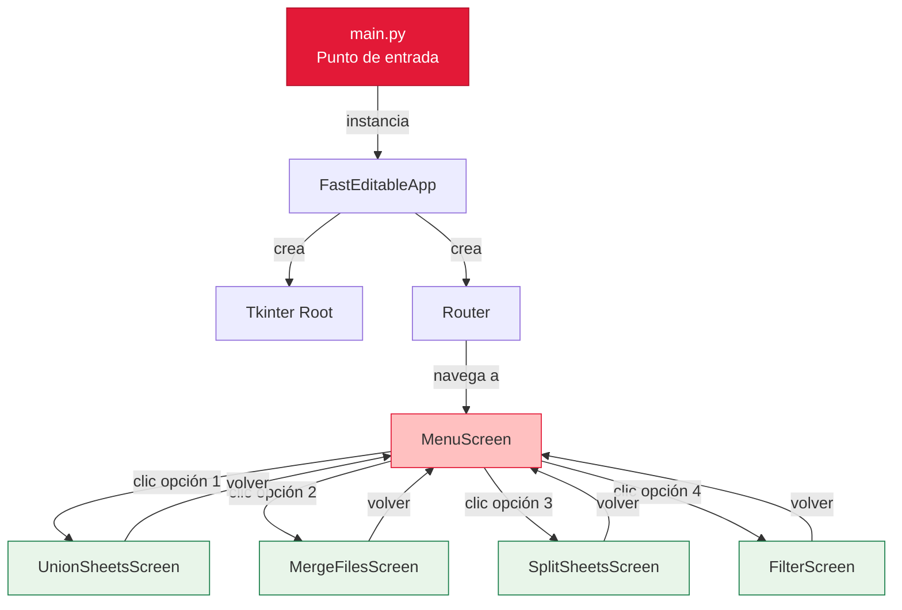
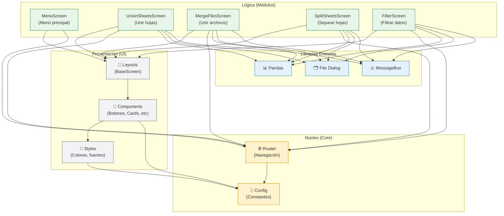
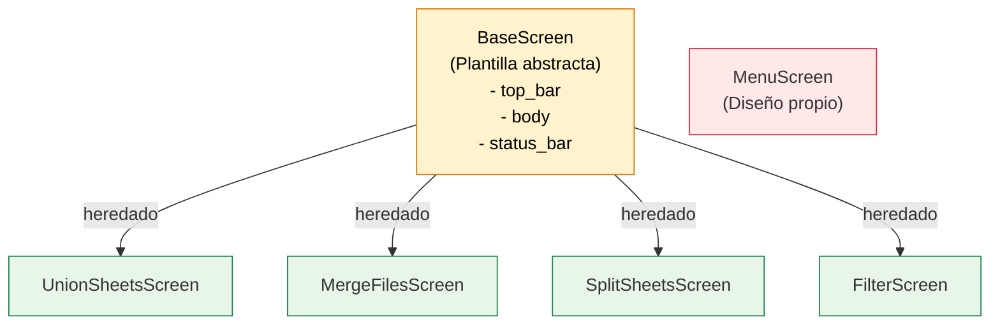
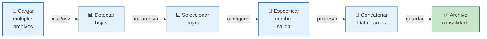
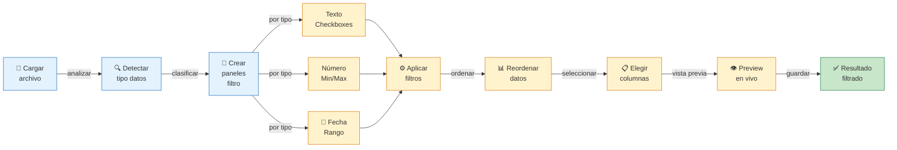
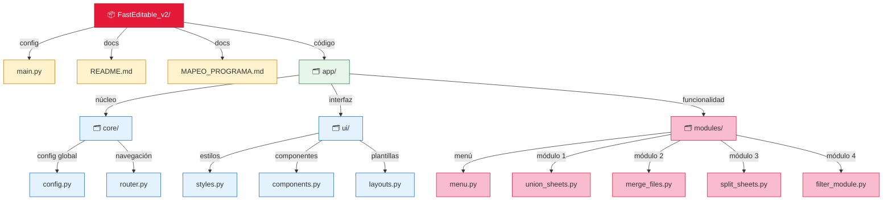

# 📊 DIAGRAMAS VISUALES — FastEditable v2.0

## Diagrama 1: Flujo General de la Aplicación



## Diagrama 2: Arquitectura de Capas



## Diagrama 3: Herencia de Pantallas



## Diagrama 4: Flujo de UnionSheets (Detallado)



## Diagrama 5: Flujo de FilterModule (Avanzado)



## Diagrama 6: Estructura de Archivos



## Diagrama 7: Ciclo de Render

```mermaid
graph TD
    A["Router.navigate<br/>(ScreenClass)"] -->|instancia| B["ScreenClass<br/>.__init__()"]
    
    B -->|llamada| C["screen.render()"]
    
    C -->|heredado| D["_build_shell<br/>(BaseScreen)"]
    
    D -->|construye| E["top_bar<br/>← VOLVER + Título"]
    D -->|construye| F["divider"]
    D -->|construye| G["body frame<br/>vacío"]
    D -->|construye| H["status_bar"]
    
    C -->|llamada| I["build_body<br/>(override)"]
    
    I -->|rellena| G
    
    J["Resultado final<br/>en pantalla"] ← E
    J ← F
    J ← G
    J ← H
    
    style A fill:#FFC0C0,stroke:#E31937
    style B fill:#FFC0C0,stroke:#E31937
    style C fill:#E3F2FD,stroke:#1D6FBF
    style D fill:#E3F2FD,stroke:#1D6FBF
    style E fill:#FFF3CD,stroke:#D97706
    style F fill:#FFF3CD,stroke:#D97706
    style G fill:#C8E6C9,stroke:#1A7F4B
    style H fill:#FFF3CD,stroke:#D97706
    style I fill:#F8BBD0,stroke:#E31937
    style J fill:#C8E6C9,stroke:#1A7F4B
```

## Diagrama 8: Flujo de Datos (Pandas)

```mermaid
graph LR
    A["Archivo(s)"] -->|pd.read_excel<br/>pd.read_csv| B["DataFrame(s)"]
    
    B -->|seleccionar| C["Filtrar columnas"]
    C -->|aplicar| D["Aplicar filtros"]
    D -->|ordenar| E["Ordenar filas"]
    E -->|combinar| F["Concatenar datos"]
    F -->|guardar| G["df.to_excel<br/>df.to_csv"]
    
    G -->|resultado| H["Archivo salida"]
    
    style A fill:#E3F2FD,stroke:#1D6FBF
    style B fill:#DBEAFE,stroke:#1D6FBF
    style C fill:#DBEAFE,stroke:#1D6FBF
    style D fill:#DBEAFE,stroke:#1D6FBF
    style E fill:#DBEAFE,stroke:#1D6FBF
    style F fill:#DBEAFE,stroke:#1D6FBF
    style G fill:#DBEAFE,stroke:#1D6FBF
    style H fill:#C8E6C9,stroke:#1A7F4B
```



## Diagrama 9: Componentes UI Reutilizables

```mermaid
graph TD
    A["🎨 UI Components"]
    
    A -->|Botones| B["PrimaryBtn<br/>(rojo fondo)"]
    A -->|Botones| C["SecondaryBtn<br/>(borde)"]
    A -->|Botones| D["GhostBtn<br/>(transparente)"]
    A -->|Botones| E["BackBtn<br/>(← VOLVER)"]
    
    A -->|Etiquetas| F["H1, H2<br/>(Títulos)"]
    A -->|Etiquetas| G["BodyLabel<br/>(Texto)"]
    A -->|Etiquetas| H["Badge<br/>(Chips color)"]
    
    A -->|Contenedores| I["Card<br/>(Frame blanco)"]
    A -->|Contenedores| J["ScrollableFrame<br/>(Scrollbar)"]
    A -->|Contenedores| K["Divider<br/>(Línea)"]
    
    A -->|Estado| L["StatusBar<br/>(Pie)"]
    
    style A fill:#E31937,stroke:#B5122B,color:#fff
    style B fill:#FFC0C0,stroke:#E31937
    style C fill:#FFC0C0,stroke:#E31937
    style D fill:#FFC0C0,stroke:#E31937
    style E fill:#FFC0C0,stroke:#E31937
    style F fill:#FFF3CD,stroke:#D97706
    style G fill:#FFF3CD,stroke:#D97706
    style H fill:#FFF3CD,stroke:#D97706
    style I fill:#F8BBD0,stroke:#E31937
    style J fill:#F8BBD0,stroke:#E31937
    style K fill:#F8BBD0,stroke:#E31937
    style L fill:#C8E6C9,stroke:#1A7F4B
```



---

**Notas:**
- 🔴 Rojo (#E31937): Elementos principales
- 🟠 Naranja (#D97706): Configuración/núcleo
- 🟢 Verde (#1A7F4B): Éxito/resultado
- 🔵 Azul (#1D6FBF): Entrada/procesamiento
- 🟡 Amarillo (#D97706): Estado/transición
